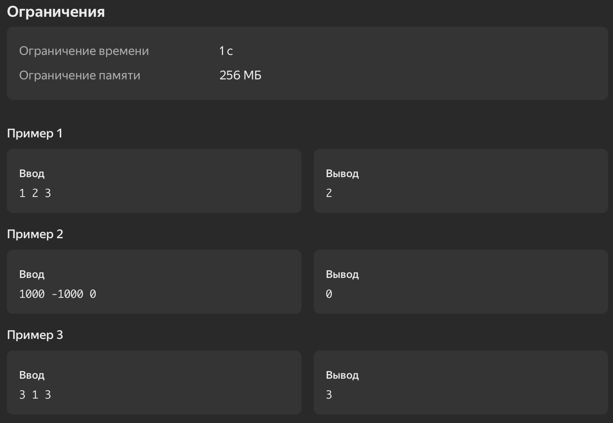

# 1. Средний элемент

Рассмотрим три числа $a, b \text{ и } c$. Упорядочим их по возрастанию.
Какое число будет стоять между двумя другими?

Решение этой задачи на С++ могло бы выглядеть так:

```cpp
#include <iostream>
#include <algorithm>

using namespace std;

int main()
{
    int a[3];
    for (int i = 0; i < 3; ++i) cin >> a[i];
    sort(a, a + 3);
    cout << a[1] << endl;
    return 0;
}
```

## Формат ввода
В единственной строке записаны три целых числа $a,b,c$ $(-1000 \leq a,b,c \leq 1000)$, числа разделены одиночными пробелами.

## Формат вывода
Выведите число, которое будет стоять между двумя другими после упорядочивания.

